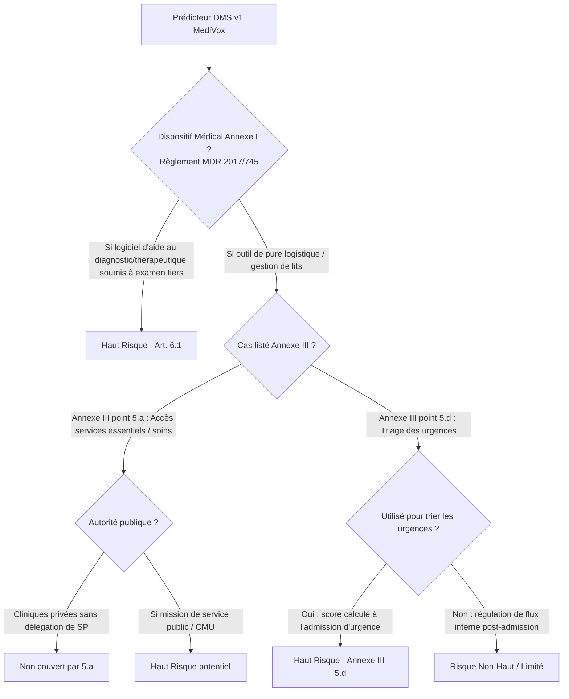

# Volet 1 — Audit Éthique, Biais & Conformité Réglementaire (MediVox)

> **Lectorats cibles** : ⚖️ Marc Lebourg (DPO) en priorité · 👩‍💻 Hélène Tournier (Directrice Technique).  
> **Données auditées** : [data/dms_dataset.csv](data/dms_dataset.csv) (10 000 séjours) · [legacy/dms_predictor_v1.joblib](legacy/dms_predictor_v1.joblib) · [legacy/train.py](legacy/train.py) & [legacy/predict.py](legacy/predict.py).

---

## 1. Disparate Impact (DI) : Mesure et Investigation Chiffrée

### 1.1 Mesure du signal d'alerte : Taux de sélection et amplification
Le Disparate Impact mesure le ratio de taux de prédiction positive entre le groupe protégé (Femmes) et le groupe de référence (Hommes). Le seuil conventionnel d'alerte (règle des 4/5) est fixé à $0{,}80$.

$$\text{DI} = \frac{P(\hat{Y} = 1 \mid \text{Sexe} = \text{F})}{P(\hat{Y} = 1 \mid \text{Sexe} = \text{M})}$$

| Échelon analysé | Taux Femmes ($N=5\,011$) | Taux Hommes ($N=4\,989$) | Disparate Impact (F / M) | Constat & Diagnostic |
|---|---|---|---|---|
| **Durée réelle observée** (`dms_jours`) | Moyenne : **5,62 jours** (médiane 5,6) | Moyenne : **5,59 jours** (médiane 5,5) | — | **Aucune différence clinique réelle** de séjour entre hommes et femmes ($p > 0{,}4$) |
| **Étiquettes historiques** (`sejour_prolonge`) | 32,07 % ($1\,607$ séjours) | 49,15 % ($2\,452$ séjours) | **0,653** (< 0,80) | **Biais d'étiquetage historique majeur** (sous-déclaration de 917 séjours féminins) |
| **Prédictions du modèle** ($\hat{Y}$ seuil 0,5) | **14,15 %** ($709$ séjours) | **48,57 %** ($2\,423$ séjours) | **0,291** (<<< 0,80) | **Effet amplificateur violent du modèle** : le modèle divise encore par plus de 2 le taux féminin |
| **Probabilité moyenne prédite** | **32,08 %** | **49,07 %** | — | Écart moyen de probabilité de **+17 points de pourcentage** en faveur des hommes |

> 🔴 **Constat d'amplification** : Alors que la durée de séjour réelle est rigoureusement identique entre les deux sexes ($5{,}62$ j vs $5{,}59$ j), le modèle prédit un risque de séjour prolongé pour **48,57 % des hommes contre seulement 14,15 % des femmes**, avec un DI effondré à **0,291**. Le modèle a sur-appris et amplifié la distorsion de l'étiquette historique.

---

### 1.2 Investigation des taux d'erreur par groupe (FNR vs FPR)
Pour comprendre comment le modèle se trompe, nous confrontons les prédictions :
1. D'abord à l'étiquette historique fournie (`sejour_prolonge`).
2. Puis à une référence clinique objective construite sur la durée réelle : $y_{\text{ref}} = (\text{dms\_jours} \ge 5{,}6\text{ jours})$ (durée à partir de laquelle 100 % des séjours masculins sont étiquetés prolongés dans l'historique).

| Métrique d'erreur | Femmes (F) | Hommes (M) | Analyse du déséquilibre |
|---|---|---|---|
| **FNR vs étiquette historique** (Faux Négatifs) | **62,8 %** ($1\,009$ séjours manqués) | **24,2 %** ($594$ séjours manqués) | Une femme à séjour prolongé étiqueté a **2,6 fois plus de risque** de ne pas être détectée |
| **FPR vs étiquette historique** (Faux Positifs) | **3,3 %** ($111$ fausses alertes) | **22,3 %** ($565$ fausses alertes) | Un homme à séjour standard a **6,8 fois plus de risque** d'être étiqueté à risque à tort |
| **FNR vs Référence objective** ($y_{\text{ref}} \ge 5{,}6$ j) | **73,7 %** ($1\,860$ séjours manqués !) | **24,2 %** ($594$ séjours manqués) | **Près de 3 femmes sur 4** en séjour long réel sont totalement ignorées par le modèle |
| **FPR vs Référence objective** ($y_{\text{ref}} < 5{,}6$ j) | **1,8 %** ($45$ fausses alertes) | **22,3 %** ($565$ fausses alertes) | Quasi-absence de fausses alertes chez les femmes, sur-alerte chez les hommes |

---

### 1.3 Utilisation directe de la variable sensible (`sexe_bin`)
* Dans [legacy/train.py](legacy/train.py#L18), la variable `sexe` est binarisée (`sexe_bin`) et injectée directement comme feature du Random Forest.
* Elle représente **9,53 % de l'importance totale des variables** du modèle (après l'âge 35,2 %, l'IMC 30,2 % et les comorbidités 25,1 %).
* **Effet marginal direct à profil clinique strictement identique** : à même âge, même IMC et même nombre de comorbidités, le simple fait de basculer la variable `sexe` de Féminin à Masculin augmente la probabilité de risque de **+16,8 points en moyenne** (et jusqu'à +70 points sur certains profils), pour **85,5 % des patients**.

---

### 1.4 Tableau de synthèse de l'investigation d'équité

| Quelle variable ? | DI (Disparate Impact) | Dans quel sens ? (Qui est désavantagé, et désavantagé à quoi ?) | Quelle question je poserais au client ? |
|---|---|---|---|
| **`sexe`** *(Variable sensible directe — F vs M)* | **$0{,}291$** sur les prédictions<br>*(contre $0{,}653$ sur les étiquettes historiques et durées réelles identiques à $5{,}6$ j)* | **Le sens dépend directement de l'usage opérationnel du score** :<br><br>• **Si usage protecteur / soins** (ex: réservation prioritaire en SSR, coordination de sortie complexe, renfort de personnel) :<br>$\rightarrow$ **Les FEMMES sont désavantagées** (taux de sélection à $14{,}1\,\%$ vs $48{,}6\,\%$ pour les hommes). Elles subissent un **Faux Négatif massif de $73{,}7\,\%$** ($1\,860$ patientes oubliées) $\rightarrow$ **Désavantagées par perte de chance médicale** et défaut d'anticipation des soins d'aval.<br><br>• **Si usage médico-économique / restrictif** (ex: contingentement des séjours longs, dépriorisation d'admission, caution financière) :<br>$\rightarrow$ **Les HOMMES sont désavantagés** avec un **Faux Positif de $22{,}3\,\%$** ($565$ alertes indues) $\rightarrow$ **Désavantagés par risque d'éviction, retard d'admission ou stigmatisation** de « profil coûteux ». | **1.** « À quel protocole soignant ou administratif précis la sortie `RISQUE_SEJOUR_PROLONGE` est-elle raccordée : allocation bienveillante de ressources (SSR) ou sélection/filtrage médico-économique des patients ? »<br><br>**2.** « Existe-t-il une justification clinique/médicale validée par le comité d'éthique pour maintenir le `sexe` comme variable d'entrée, sachant que la durée réelle de séjour est rigoureusement identique entre hommes et femmes ($5{,}62$ j vs $5{,}59$ j) ? » |
| **`age`** *(Variable protégée / démographique — $<65$ ans vs $\ge 65$ ans)* | **$0{,}351$**<br>*(Taux de sélection : $18{,}4\,\%$ pour les $<65$ ans vs $52{,}3\,\%$ pour les seniors $\ge 65$ ans)* | • **Si usage protecteur** : Les patients de **$<65$ ans** sont moins souvent orientés vers des dispositifs d'anticipation (parfois à tort en cas de comorbidités aiguës).<br>• **Si usage restrictif** : Les **seniors ($\ge 65$ ans)** sont massivement sur-sélectionnés comme profils à risque, ce qui peut freiner leur accès à certaines chirurgies programmées. *(Ici, l'âge a toutefois une plausibilité clinique forte contrairement au sexe).* | « Le seuil de risque accru pour les plus de 65 ans correspond-il aux référentiels gériatriques internes, ou les jeunes patients polypathologiques sont-ils sous-détectés ? » |
| **`service`** *(Proxy indirect potentiel — médecine vs cardiologie/chirurgie)* | **$0{,}714$** *(min/max)*<br>*(Taux de sélection : $25{,}0\,\%$ en médecine vs $35{,}0\,\%$ en gériatrie)* | Le modèle n'utilise pas le service en feature explicite, mais le comportement moyen reflète la gravité des spécialités. Les patients de **médecine générale** ont un taux d'alerte plus faible que la gériatrie ou la chirurgie. | « Pourquoi le prestataire historique a-t-il exclu la variable `service` du modèle alors qu'elle structure les flux de lits et les durées moyennes de séjour dans les cliniques ? » |

---

## 2. Définition du Préjudice Patient : Comment trancher selon l'usage réel

Le disparate impact et les taux d'erreur révèlent une asymétrie massive. Pour déterminer **qui est lésé**, il est impossible de rester sur un « ça dépend » théorique. Le préjudice dépend directement de ce que MediVox fait du score :

```mermaid
flowchart TD
    Score[Score de prédiction DMS v1] --> Usage{Quel est l'usage réel du score ?}
    Usage -->|Hypothèse A : Soin & Allocation de ressources| PrejA[Usage Protecteur : Anticipation lit SSR, staff de sortie]
    Usage -->|Hypothèse B : Médico-économique & Régulation| PrejB[Usage Restrictif : Dépriorisation, refus admission, surcoût]
    PrejA --> LesesA[<b>Femmes massivement lésées (FNR = 73,7%)</b><br>Perte de chance d'accès aux soins de suite et d'anticipation]
    PrejB --> LesesB[<b>Hommes pénalisés (FPR = 22,3%)</b><br>Stigmatisation de profil coûteux, risque d'éviction]
```

### Grille d'arbitrage du préjudice

| Hypothèse d'usage opérationnel chez MediVox | Mécanisme clinique / organisationnel | Groupe lésé | Nature exacte du préjudice |
|---|---|---|---|
| **Hypothèse A : Usage protecteur / organisationnel** (ex: réservation prioritaire en SSR, coordination précoce de sortie complexe, renfort soignant) | Le signal positif ouvre l'accès à un dispositif d'accompagnement ou de sécurisation du parcours. | **Les Femmes** (victimes d'un FNR massif de **73,7 %**) | **Perte de chance médicale** : 1 860 patientes ayant un séjour long effectif ne bénéficient d'aucun accompagnement anticipé, entraînant retards de prise en charge et complications. |
| **Hypothèse B : Usage restrictif / médico-économique** (ex: filtrage des admissions de chirurgie programmée, pénalisation des séjours non rentables, caution) | Le signal positif marque le patient comme « risque financier / bloqueur de lit ». | **Les Hommes** (victimes d'un FPR élevé de **22,3 %**) | **Discrimination à l'accès aux soins** : 565 hommes subissent des restrictions, retards opératoires ou surprimes sur la base d'une prédiction erronée. |

> 📌 **Question ouverte bloquante pour trancher** :  
> *« À quel protocole soignant ou administratif la sortie `RISQUE_SEJOUR_PROLONGE` est-elle branchée dans le SI des cliniques MediVox ? Les lits d'aval (SSR) sont-ils pré-réservés sur ce score ? »*

---

## 3. Conformité RGPD Santé (Données de catégorie particulière)

### 3.1 Article 9 du RGPD : Traitement de données relatives à la santé
* **Interdiction de principe et base d'exception** : L'article 9(1) prohibe le traitement des données de santé, sauf dérogation de l'article 9(2). Dans le cas d'un prédicteur DMS exploité par des cliniques privées :
  * La base légale la plus probable relève de l'article **9(2)(h)** : « *gestion des systèmes et des services de soins de santé ou de sécurité sociale* ».
  * **Point d'alerte DPO** : Cette exception exige que le traitement soit mis en œuvre par un professionnel de santé soumis au secret professionnel (ou sous sa responsabilité). Or, le script [legacy/predict.py](legacy/predict.py) tourne via SSH sur une machine isolée sans traçabilité des utilisateurs ni contrôle d'habilitation.
* **Principe de minimisation (Art. 5(1)(c) RGPD)** :
  * L'intégration directe de la variable `sexe` sans justification clinique validée constitue un manquement flagrant à la minimisation.
  * Aucune étude médico-statistique interne ne prouve la nécessité du sexe pour prédire la DMS chez MediVox (d'autant que les distributions de durée réelle sont identiques).
* **Conservation et Sécurité (Art. 5(1)(e) et 32)** :
  * Le dataset [data/dms_dataset.csv](data/dms_dataset.csv) stocke en clair des identifiants patients (`patient_id`), des données physiologiques (`age`, `imc`, `nb_comorbidites`) et des services d'hospitalisation sans pseudonymisation forte.
  * Absence de chiffrement au repos et de politique de purge documentée.

### 3.2 Article 22 du RGPD : Décision individuelle exclusivement automatisée
L'article 22 prohibe qu'une personne fasse l'objet d'une décision produisant des effets juridiques ou l'affectant de manière significative, si elle est fondée *exclusivement* sur un traitement automatisé.

L'examen porte sur les **deux conditions cumulatives** :
1. **Condition 1 : Traitement exclusivement automatisé (ou absence de supervision humaine effective)**
   * Dans le code actuel [legacy/predict.py](legacy/predict.py#L20-L21), le script émet directement une étiquette binaire : `RISQUE_SEJOUR_PROLONGE` ou `SEJOUR_STANDARD`.
   * **Jurisprudence CJUE *SCHUFA* (C-634/21, déc. 2023)** : Si le personnel clinique ou administratif applique le résultat du score de manière quasi-systématique sans réévaluation clinique personnalisée et motivée, le score est requalifié en décision automatisée au sens de l'article 22.
   * L'absence actuelle de journalisation empêche de prouver l'existence d'un « override » humain.
2. **Condition 2 : Effet juridique ou similairement significatif**
   * Si le score conditionne un refus d'admission, une déprogrammation opératoire, ou l'orientation forcée vers un autre établissement : **l'effet significatif est caractérisé**.
   * S'il s'agit d'une simple indication indicative interne pour préparer la commande des repas : l'effet n'est pas significatif.

---

## 4. Qualification Raisonnée au titre de l'AI Act (Règlement UE 2024/1689)

La qualification du niveau de risque selon l'AI Act ne doit **jamais être présumée** sous prétexte que le secteur est la santé. Elle doit résulter d'une analyse méthodique de l'article 6 et de ses annexes.



### 4.1 Cheminement de qualification (Art. 6)
1. **Annexe I (Dispositif médical - MDR 2017/745)** :
   * Le prédicteur DMS n'a pas de finalité diagnostique ou thérapeutique revendiquée dans son état actuel. S'il n'est pas qualifié de dispositif médical avec évaluation de conformité par un organisme notifié, il échappe à l'article 6(1).
2. **Annexe III point 5 (Accès aux services essentiels et services publics / Soins de santé)** :
   * *Point 5.a* : Vise les systèmes d'IA destinés à évaluer l'éligibilité des personnes physiques aux prestations de services essentiels de santé *par des autorités publiques ou pour leur compte*. MediVox étant un groupe de cliniques privées, ce point s'applique uniquement si les cliniques agissent sous conventionnement/délégation publique exclusive.
   * *Point 5.d* : Vise explicitement les **systèmes d'IA destinés à être utilisés pour le triage des patients dans le cadre des services d'urgence**. Dans le dataset, `type_admission == 'urgence'` représente une part importante des flux. Si le script `predict.py` est appelé dès l'accueil des urgences pour décider de l'admission ou de l'orientation, **le prédicteur bascule en Haut Risque au titre de l'Annexe III point 5.d**.
3. **Examen de l'exception de l'article 6(3)** :
   * Un système relevant de l'Annexe III peut être exempté de la qualification haut risque s'il n'altère pas matériellement l'issue de la décision (tâche purement accessoire/préparatoire).
   * **Exception fermée** : L'article 6(3) dernier alinéa précise qu'un système d'IA est **toujours considéré à haut risque s'il effectue un profilage de personnes physiques**. Or, attribuer un score de risque de séjour à partir de l'âge, du sexe et des comorbidités constitue juridiquement un profilage au sens de l'art. 4(4) du RGPD. L'exception ne peut donc pas être invoquée.

### 4.2 Conséquences réglementaires si le Haut Risque est retenu
Si l'usage réel aux urgences ou en régulation classe le système en Haut Risque, le modèle actuel accumule des non-conformités critiques bloquantes :
* **Art. 9 (Système de gestion des risques)** : Inexistant.
* **Art. 10 (Gouvernance des données et biais)** : Violé (données historiques non représentatives, biais d'étiquetage de 36 %, disparate impact de 0,291 non traité).
* **Art. 12 (Conservation des logs)** : Violé (aucune journalisation automatique des inférences).
* **Art. 13 (Transparence)** : Violé (aucune notice d'information fournie aux utilisateurs soignants).
* **Art. 14 (Contrôle humain)** : Violé (aucun bouton de débrayage, aucune information de confiance/probabilité restituée de façon ergonomique).

---

## 5. Synthèse des Risques Éthiques & Questions Bloquantes

| Réf | Risque identifié | Niveau de gravité | Conséquence directe pour MediVox |
|---|---|---|---|
| **ETH-01** | Disparate impact violent ($0{,}291$) et amplification du biais de genre | 🔴 Élevé | Risque d'accusation de discrimination indirecte systémique et perte de chance massive pour les femmes (FNR 73,7 %). |
| **ETH-02** | Variable `sexe` en entrée directe sans justification médicale | 🔴 Élevé | Manquement caractérisé au principe de minimisation (Art. 5(1)(c) RGPD). Non défendable lors d'un contrôle CNIL. |
| **ETH-03** | Décision automatisée sans traçabilité du contrôle humain (Art. 22 RGPD) | 🔴 Élevé | Exposition au contentieux patient (jurisprudence *SCHUFA*) en cas d'impact sur l'admission ou le transfert. |
| **ETH-04** | Qualification potentielle AI Act Annexe III 5.d (urgences) non sécurisée | 🟠 Moyen / 🔴 Élevé | Sanctions financières majeures (jusqu'à 35 M€ ou 7 % du CA) si déployé en triage d'urgences sans conformité. |

### ❓ Questions ouvertes pour le DPO (Marc Lebourg) et la direction médicale :
1. **Sur l'usage opérationnel** : Le score conditionne-t-il directement l'accès à des ressources critiques (lits SSR, triage aux urgences, refus d'admission) ?
2. **Sur le contrôle humain** : Le praticien a-t-il la possibilité technique et temporelle d'ignorer la recommandation ? Cette décision d'écartement est-elle tracée ?
3. **Sur la justification du sexe** : Existe-t-il une base médicale validée par le comité d'éthique clinique justifiant le maintien du sexe biologique comme variable prédictive ?
